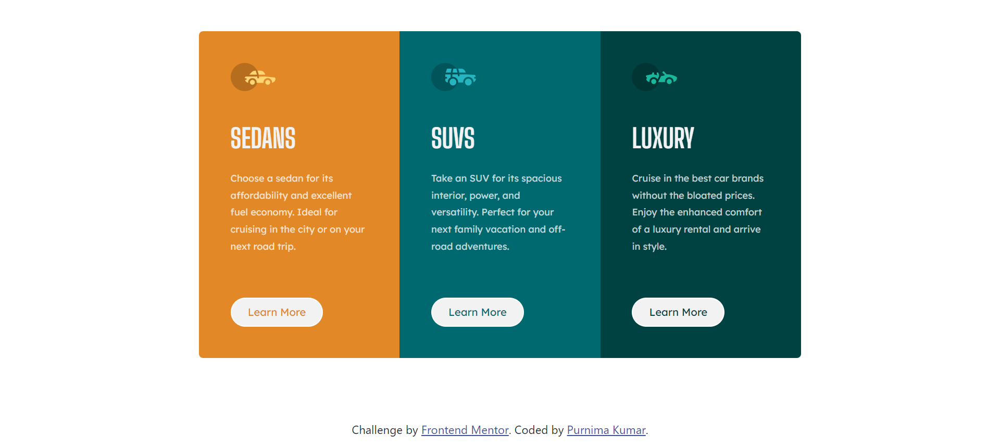
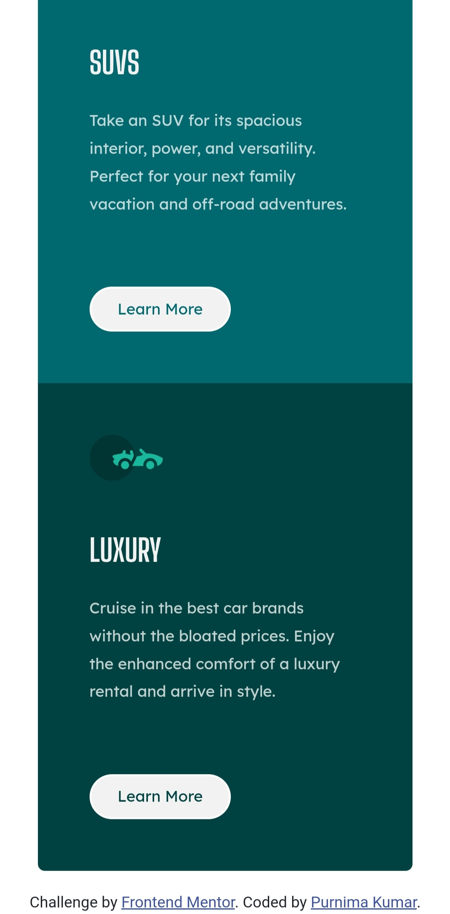

# Frontend Mentor - 3-column preview card component solution

This is a solution to the [3-column preview card component challenge on Frontend Mentor](https://www.frontendmentor.io/challenges/3column-preview-card-component-pH92eAR2-). Frontend Mentor challenges help you improve your coding skills by building realistic projects.

## Table of contents

- [Overview](#overview)
  - [The challenge](#the-challenge)
  - [Screenshot](#screenshot)
  - [Links](#links)
- [My process](#my-process)
  - [Built with](#built-with)
  - [What I learned](#what-i-learned)
- [Author](#author)

## Overview

### The challenge

Users should be able to:

- View the optimal layout depending on their device's screen size
- See hover states for interactive elements

### Screenshot

#### Desktop

#### Mobile

### Links

- Solution URL: [Add solution URL here](https://github.com/purnimakumarr/frontendmentor/tree/main/3-column-preview-card-component)
- Live Site URL: [Add live site URL here](https://purnimakumarr.github.io/frontendmentor/3-column-preview-card-component/)

## My process

### Built with

- Semantic HTML5 markup
- CSS custom properties
- Bootstrap v5.2
- Web-first workflow

### What I learned

Grid System provided by Bootstrap

## Author

- Website - [Purnima Kumar](https://purnimakumarr.github.io/)
- Frontend Mentor - [@purnimakumarr](https://www.frontendmentor.io/profile/purnimakumarr)
- Twitter - [@yourusername](https://www.twitter.com/purnimakumarr)
