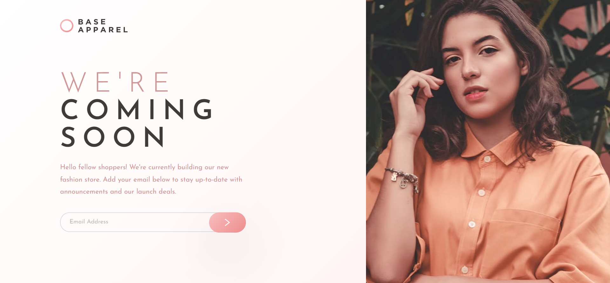

# Frontend Mentor - Base Apparel coming soon page solution

This is a solution to the [Base Apparel coming soon page challenge on Frontend Mentor](https://www.frontendmentor.io/challenges/base-apparel-coming-soon-page-5d46b47f8db8a7063f9331a0). Frontend Mentor challenges help you improve your coding skills by building realistic projects.

## Table of contents

- [Overview](#overview)
  - [The challenge](#the-challenge)
  - [Screenshot](#screenshot)
  - [Links](#links)
- [My process](#my-process)
  - [Built with](#built-with)
  - [What I learned](#what-i-learned)
- [Author](#author)

## Overview

### The challenge

Users should be able to:

- View the optimal layout for the site depending on their device's screen size
- See hover states for all interactive elements on the page
- Receive an error message when the `form` is submitted if:
  - The `input` field is empty
  - The email address is not formatted correctly

### Screenshot

#### Desktop

#### Mobile

### Links

- Solution URL: [View code](https://github.com/purnimakumarr/frontendmentor/tree/main/base-apparel-coming-soon-page)
- Live Site URL: [View site](https://purnimakumarr.github.io/frontendmentor/base-apparel-coming-soon-page/)

## My process

### Built with

- Semantic HTML5 markup
- CSS custom properties
- CSS Grid
- Web-first workflow
- Vanilla JavaScript

### What I learnt

I learnt about email validation using JavaScript.

## Author

- Website - [Purnima Kumar](https://purnimakumarr.github.io/)
- Frontend Mentor - [@purnimakumarr](https://www.frontendmentor.io/profile/purnimakumarr)
- Twitter - [@purnimakumarr](https://www.twitter.com/purnimakumarr)
