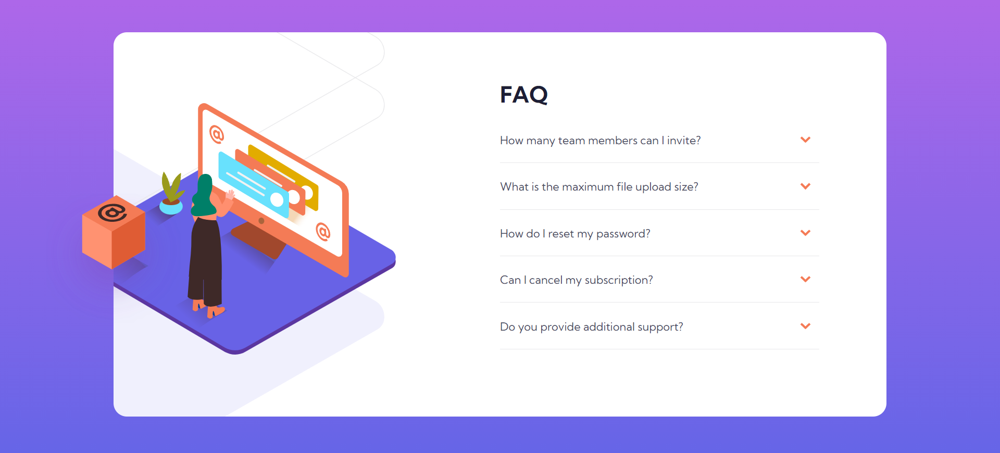
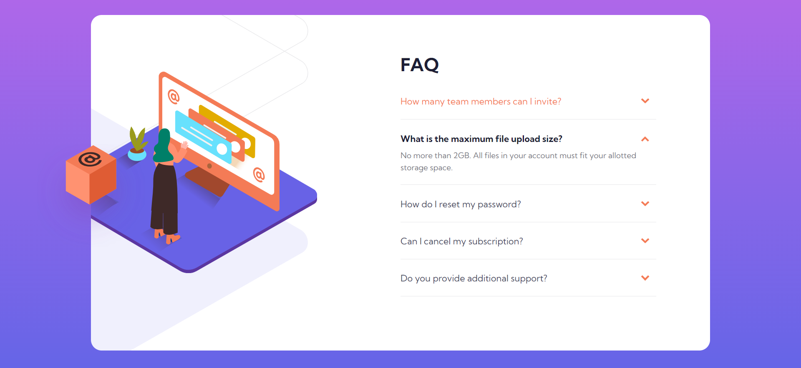

# Frontend Mentor - FAQ accordion card solution

This is a solution to the [FAQ accordion card challenge on Frontend Mentor](https://www.frontendmentor.io/challenges/faq-accordion-card-XlyjD0Oam). Frontend Mentor challenges help you improve your coding skills by building realistic projects.

## Table of contents

- [Overview](#overview)
  - [The challenge](#the-challenge)
  - [Screenshot](#screenshot)
  - [Links](#links)
- [My process](#my-process)
  - [Built with](#built-with)
  - [What I learned](#what-i-learned)
- [Author](#author)

## Overview

### The challenge

Users should be able to:

- View the optimal layout for the component depending on their device's screen size
- See hover states for all interactive elements on the page
- Hide/Show the answer to a question when the question is clicked

### Screenshot

#### Desktop

#### Mobile

### Links

- Solution URL: [View code](https://github.com/purnimakumarr/frontendmentor/tree/main/faq-accordion-card)
- Live Site URL: [View site](https://purnimakumarr.github.io/frontendmentor/faq-accordion-card/)

## My process

### Built with

- Semantic HTML5 markup
- CSS custom properties
- Flexbox
- CSS Grid
- Web-first workflow
- Vanilla JavaScript

### What I learned

I learnt about positioning elements using a combition of `position`, `top`, `left`, `right`, `bottom` css properties.

## Author

- Website - [Purnima Kumar](https://purnimakumarr.github.io/)
- Frontend Mentor - [@purnimakumarr](https://www.frontendmentor.io/profile/purnimakumarr)
- Twitter - [@purnimakumarr](https://www.twitter.com/purnimakumarr)
